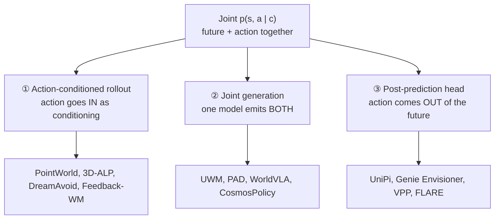

# The Anatomy, Ingredient 2: How Does Action Enter and Leave?

You've chosen *what* future to predict (the substrate). Now the decisive question:

> "Action coupling is the structural decision that turns a predictive world model into a WAM." — *Section 4.3*

A world model that just predicts the future isn't a WAM. Coupling is how you wire the action *in* (as conditioning) or *out* (as a decoded result). The survey identifies exactly **three top-level factorizations** of the joint `p(s, a | c)`:

## ① Action-conditioned rollout — propose an action, predict its consequence

Here an *action source* (a planner, policy, candidate sampler, tree search, or human stream) supplies actions, and an action-conditioned world model predicts what they'd cause. The action enters as **conditioning**.

> qψ(a | c) · pθ(s | c, a)  — chunk-level (*Equation 10*)

It comes in two submodes:

- **Chunk-level** — propose a whole action chunk *before* the prediction starts. PointWorld samples robot point-flow chunks with MPPI and scores the predicted scene flow; 3D-ALP uses MCTS to propose actions and a 3D renderer as a rollout oracle; DreamAvoid samples flow-policy chunks only at *critical phases*.
- **Step-wise** — alternate one action and one predicted state, so the action source can react *inside* the imagined trajectory. This is the model-based-RL lineage (PlaNet, DreamerV3, Dreamer 4); in the current census almost everything sits on the chunk-level submode.

> **Isn't this just an action head by another name?** No — the world model here *scores or corrects* proposed actions; it doesn't *produce* them. That's the whole point: **counterfactual control.** Candidate actions shape the future *before* selection. The cost: chunk-level can evaluate many candidates in parallel but can't react to a signal that changes mid-window; step-wise can react each step but loses that parallelism.

## ② Joint generation — one model emits future and action together

> pθ(st+1:t+H, at:t+H−1 | c)  — *Equation 11*

A single generative process on a shared backbone produces *both* the future substrate and the action chunk in one sampled trajectory. Training is a weighted sum:

> Ljoint = Lgen(s) + λ · Lact(a)  — *Equation 19*

— a diffusion/autoregression loss on the future plus a flow-matching/regression/cross-entropy loss on the action. It shows up in two flavors:

- **Joint diffusion** of video and action: UWM, CosmosPolicy, VideoVLA, DriveWAM place video latents and action variables in the *same* denoising state, so one sample carries both.
- **Joint autoregression** of frame and action tokens: GR-1/GR-2 predict next-frame and next-action tokens over a discrete codebook; WorldVLA adds an action-chunk attention mask.

> The benefit: one coupled sample yields strong **mutual consistency** between the predicted world and the chosen action. The cost: **training instability** — the generation and action losses can pull the shared representation in different directions. The standard fix is to pretrain the substrate head on video, then add the action head later with a careful λ schedule.

## ③ Post-prediction head — decode the action *from* a finished future

> pθ(st+1:t+H | c) · qψ(at:t+H−1 | st+1:t+H, c)  — *Equation 12*

Predict the substrate first, then a *separate, smaller* action expert `qψ` (often a tracker, inverse-dynamics model, optimizer, or policy) decodes the action from it. Crucially, `θ` is **frozen** in many implementations while `qψ` trains.

> "This arrangement is common because it lets a pretrained predictor stay fixed while the action head changes across embodiments." — *Section 4.3.3*

UniPi is the canonical case — a diffusion video plan, then inverse dynamics. FLARE aligns policy tokens to teacher embeddings, then an action expert reads them. The action expert stays cheap and embodiment-swappable, **but only works if the chosen substrate preserves the action-relevant part of the forecast.** Skip too much of the future and the head has nothing useful to read.

## Two nested choices inside every coupling: representation and chunk size

Whichever family you pick, the action variable `a` is still parameterized, and *how many* actions you emit per pass is a separate lever:

| Action representation | Example |
|----------------------|---------|
| Per-step **continuous controls** (`A = ℝ^da`) — joint velocities, end-effector deltas | most policies |
| **Discrete tokens** from a fixed codebook | WorldVLA (per-dimension binning) |
| **Learned latent actions** (`A = ℝ^dz`, `dz ≪ da`) — currency between world model and policy | Motus, ALAM, LDA-1B |

And the chunk-size trade-off is the one that quietly governs real-robot feasibility:

> "A model that produces one action per forward pass pays a low per-action latency but invokes the full backbone at the control frequency. A model that produces a long chunk... spreads the backbone cost over the chunk but cannot react during it." — *Section 4.3.4*

> "Closed-loop control on real hardware pushes methods toward smaller chunks or toward cheaper backbones." — *Section 4.3.4*

Hold that sentence — it's the pressure that explains nearly every backbone choice in the next lesson.
