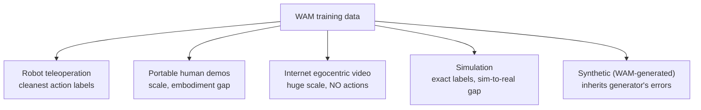
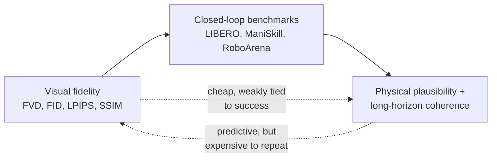

# Data and Evaluation: You Can Only Test What You Expose

A WAM is only as good as the data it learns from and the protocol that judges it. The survey ties these together tightly:

> "A WAM can only preserve the properties of Section 5 when its training data and evaluation protocol expose those properties." — *Section 6*

Both questions reduce to the same trade-off you've seen all module: richer-but-expensive vs. cheaper-but-lossy. For data it's **scale vs. action-label fidelity vs. embodiment match**. For evaluation it's **visual fidelity vs. closed-loop success vs. physical plausibility vs. cost**.

## Five data sources, five compromises

| Source | What it gives | What it costs | Examples |
|--------|--------------|---------------|----------|
| **Robot teleoperation** | The cleanest action-conditioned trajectories — a human drives the robot, commands logged with video | Every hour consumes robot time, operator time, or both | Open X-Embodiment, RoboMIND, RoboSet |
| **Portable human demos** | Scale — wearable/handheld capture is faster than robot teleop | An **embodiment gap** that must be closed before it can train a robot | EgoMimic, EgoVerse, EgoDex (Vision Pro) |
| **Internet egocentric video** | Massive visual variation, object dynamics, human manipulation | **No action channel** — needs an inverse-dynamics or latent-action model to recover a control proxy | Ego4D, EPIC-KITCHENS, EgoVid-5M |
| **Simulation** | Exact action labels, controlled curricula, low marginal cost | The **sim-to-real gap** | ManiSkill, MetaWorld, LIBERO, RoboCasa |
| **Synthetic (WAM-generated)** | A WAM as a *data engine* — inherits internet-pretraining realism | Inherits the **generator's failure modes** | DreamGen (pseudo-actions), IRASim, RIGVid |

> **So why not just train on internet video — there's so much of it?** Because *"Internet video is a scale source only after the action-label problem has been made explicit."* It teaches what the world looks like and how objects move, but it never recorded the robot's actions. You either use it to pretrain a video backbone (V-JEPA 2, Wan) or bolt on a model that recovers a control proxy (AVDC recovers flow-conditioned action; LDA-1B and DUST use action-free video to strengthen latent prediction).

In practice WAM training **mixes** all five: internet video for priors, teleoperation for trusted labels, portable human data for scale, simulation for coverage, synthetic to fill expensive gaps. The unresolved question — *how to choose the mixture for a target deployment regime* — returns as an open challenge.

## Evaluation: three tiers, ordered by cost and predictiveness

Evaluation must judge **both** prediction and action — and neither alone is enough:

> "Video-generation metrics ask whether the future looks plausible. Robot-learning benchmarks ask whether the policy succeeds in the loop. A WAM needs both perspectives, but neither is sufficient on its own." — *Section 6.2*

| Tier | What it measures | The catch |
|------|------------------|-----------|
| **Visual fidelity** (FVD, FID, LPIPS, PSNR, SSIM, DreamSim) | Does the future *look* plausible? | Cheap and familiar — but **rewards realism, not action utility.** A crisp rollout can be useless; a visually sparse one can drive a successful policy (Fast-WAM, GigaWorld-Policy drop the rendered forecast and keep control) |
| **Closed-loop** (LIBERO, ManiSkill, MetaWorld; real arenas RoboArena, RoboChallenge) | Does the policy *complete the task*? | Throughput-vs-validity dial: sim is fast, real hardware is valid but expensive. Every trial consumes a robot, sim, or generator for the whole task |
| **Physical plausibility + long-horizon** | Tactile/force error, kinematic consistency, coherence over many replans | **No standard metric has emerged.** Current benchmarks don't test hour-scale rollout at control frequency |

The survey reads a consistent **cost ordering** off this:

> "Visual-fidelity metrics are cheap but weakly tied to downstream success. Closed-loop simulation is more predictive but consumes task-time rollouts. Real-robot arenas are physically valid but expensive to repeat." — *Section 6.2*

And the punchline — the methods that matter most are the hardest to test:

> "The WAMs that matter for real use are also the hardest to evaluate, because chunked and interactive closed-loop control require longer horizons, stricter latency constraints, and real-environment variation." — *Section 6.2*

The field is converging on a **two-stage protocol**: cheap visual/representation screens first, then *selective* closed-loop tests under explicit compute, memory, and latency budgets. The conversion factor between the cheap screen and the expensive test is, the survey says, the central open question in WAM evaluation.
