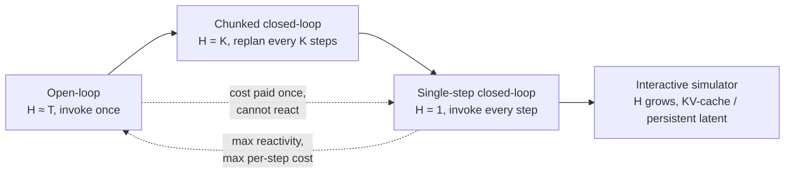

# The Anatomy, Ingredient 4: When Is the Model Invoked? — and the 4-Tuple

The first three ingredients are mostly fixed at *training* time. The fourth is where a model meets the clock. The deployment regime is the choice of **horizon `H`** and the **cadence** with which the WAM is invoked relative to the control loop.

Set up three quantities: `T` is the task length in control steps, `N_fwd(H)` is the cost of one forward pass producing a length-`H` trajectory, and `f_ctrl` is the control frequency. The four regimes differ only in how they spend `N_fwd` over the task — and how often new observations can revise the plan.

## Open-loop rollout — generate once, then just execute

`H ≈ T`, one invocation. A long future window is generated *before* execution and a separate actor consumes it.

> Copen(T) = Nfwd(T)  — paid once per scenario, *Equation 33*

UniPi, AVDC, Dreamitate, RoboEnvision run this way. The cost is paid once and doesn't scale with `f_ctrl` — but **the rollout can't react to real-world deviation**, so the actor must absorb every distribution shift alone.

## Chunked closed-loop — amortize a big backbone over a chunk

`H = K`, invoked every `K` control steps. Produce an action chunk of length `K`, execute it, then re-invoke.

> Cchunk(T, K) = ⌈T/K⌉ · Nfwd(K)  — *Equation 34*

This interpolates between open-loop (`K → T`) and single-step (`K → 1`), and it's feasible only while `N_fwd(K)/K < 1/f_ctrl` — the next chunk must be ready before the current one is consumed.

> **Why is this the most common real-robot choice?** Because it *amortizes a large backbone over multiple control ticks.* You pay for one heavy forward pass, then ride it for `K` steps. The limitation is **staleness** — a long chunk can't see the world change mid-execution. That's why adaptive variants exist: FFDC-WAM's verifier triggers an early replan when imagination drifts; WALL-WM ties the chunk window to the next semantic event.

## Single-step closed-loop — one prediction, one action, every tick

`H = 1`, invoked at every control step. Maximum reactivity, maximum per-step cost:

> Csingle(T) = T · Nfwd(1),  subject to Nfwd(1) < 1/fctrl  — *Equation 35*

WorldVLA, GR-1, PAD, VPP, DreamZero sit here. It's only feasible when the substrate is **sparse** — feature, geometric, affordance, or a pixel-decodable latent — so one forward pass fits inside the control period. You can't run a full pixel render here.

## Interactive simulator — steerable, no fixed endpoint

The WAM is invoked every step but **reuses the past via a KV-cache or persistent latent** of growing state size `M(t)`:

> Cint(t) = Nfwdcached(M(t))  — *Equation 36*

For attention backbones the cached pass is linear in `M(t)` per step, so cumulative cost is **quadratic in `t`**. InteractiveWorldSimulator, EnerVerse, LingBot-VA approach this. The defining property: the model can be *steered mid-stream*, and the cache carries the long-horizon trajectory. The cost pressure lands on **memory, not per-step compute** — which Section 5 revisits as *persistence*.

## Putting it together: every WAM is a 4-tuple

Sections 4.2–4.5 let you pin down any WAM as a compact tuple over the four axes:

> WAM ≅ ( Φ, F, B, D )  — *Equation 37*

| Axis | Symbol | Values |
|------|--------|--------|
| Substrate | Φ | pixel-grounded / feature / geometric / affordance |
| Coupling | F | action-conditioned rollout / joint generation / post-prediction head |
| Backbone | B | diffusion / autoregressive / joint-embedding / hybrid / LLM-VLM |
| Deployment | D | open / chunked / single / interactive |

Worked placements from the census:

| WAM | Φ | F | B | D |
|-----|-----|-----|-----|-----|
| **F1** | pixel (latent) | joint generation | hybrid | chunked |
| **WorldVLA** | pixel (latent) | joint generation | autoregressive | single |
| **FLARE** | feature (teacher) | post-prediction head | joint-embedding | chunked |
| **UWM** | pixel (latent) | joint generation | hybrid | chunked |

> **So when is a plain video model like Wan or CogVideoX a WAM?** It isn't — on its own it fixes only Φ and B. *"They become a WAM only once F and D are added,"* which is exactly the wrapper-around-a-frozen-backbone pattern (CosmosPolicy, VidMan, VideoVLA).

## What the tuple reveals about the field

The survey reads a direction straight off the tuple. Φ and B are **training-time** choices that get heavy attention (picking a pretrained backbone is the expensive decision). F and D are **flexible at inference**, and that's where recent mechanisms cluster — adaptive-`K` chunking, event-triggered invocation, dual-frequency slow-fast loops. And the expensive corner everyone avoids:

> "The expensive corner of the design space combines a decoded pixel-grounded substrate, joint generation, a diffusion backbone, and single-step closed-loop deployment. Few methods can use that corner directly in production." — *Section 4.6*

Designs that *appear* to use that corner usually trade one coordinate away — for simulation, an offline rollout, or a smaller inference-time model. **Dream less, act more**, expressed as a tuple.
