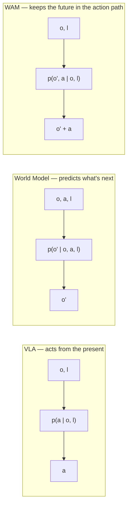
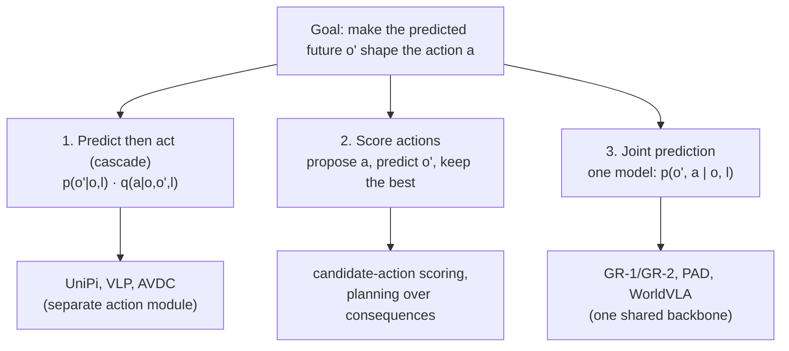

# What is a World Action Model?

A robot is about to push a mug across a table. Before it moves, you'd like it to *anticipate*: where will the mug end up, will it tip, will the gripper still be in frame? A plain instruction-following policy never asks. It maps **what it sees right now** straight to **the next action** — no account of physics, contact, or how the scene will change under its own hand.

That gap is exactly what this survey is about. As the abstract puts it:

> "World Action Models (WAMs) are embodied predictive-action models that make a forecast of the future available to action." — *Abstract*

Hold onto that phrase — *a forecast of the future, made available to action*. Everything else is detail.

## Three things that look alike — and the boundary between them

The field tangled three ideas together. The survey's job (Section 2) is to pull them apart. Let one symbol carry the whole story: **o** is an observation, **l** a language instruction, **a** an action, and **o′** a *predicted future* observation.

| Model | What it computes | What it's missing |
|-------|------------------|-------------------|
| **Vision-Language-Action (VLA)** | `p(a \| o, l)` — act from the present | Never predicts what happens *after* it acts |
| **World Model** | `p(o′ \| o, a, l)` — predict the next observation | Doesn't necessarily *choose* the action |
| **World Action Model (WAM)** | `p(o′, a \| o, l)` — predict the future *and* act on it | — it links the other two |

> **Wait — isn't a VLA already "intelligent enough"?** It can be. RT-2, OpenVLA, and the π series showed that internet-scale vision-language pretraining grounds beautifully into robot actions. But Equation 1 — `L_VLA = E[−log p(a | o, l)]` — *never requires the model to predict what it will observe after acting*. It reasons from the present alone. The moment a predicted future starts shaping the action, it stops being a VLA and becomes a WAM.

## The boundary, stated precisely

The survey draws a hard line — this is the test you apply to any new paper:

> "The predicted future must produce, score, verify, or train the action." — *Figure 1*

Fail that test and you don't have a WAM. The paper is explicit about the near-misses:

- A direct VLA with an **auxiliary future loss** that's discarded before acting → **not** a WAM (the future never reaches the action).
- A **simulator used only as an RL environment** → **not** a WAM (the future trains a policy, but isn't part of the model's own action path).
- A **future head thrown away before action use** → **not** a WAM.

The future has to *do work* on the action. That's the whole contract.

## Three ways the future reaches the action

A WAM can wire that contract three ways. Notice they're just different factorizations of the same joint distribution `p(o′, a | o, l)`:

1. **Predict then act** — `p(o′|o,l) · q(a|o,o′,l)`. Generate a future first, then a *separate* module (inverse dynamics, a pose tracker, a trajectory optimizer, a planner) recovers the action. This is the historically early form: UniPi, VLP, and AVDC generated future visual trajectories, then decoded executable actions.
2. **Score actions** — `q(a|o,l) · p(o′|o,a,l)`. Propose an action, predict its consequence, and let the predicted consequence decide which action runs. This covers candidate-action scoring and planning.
3. **Joint prediction** — `p(o′, a | o, l)`. One backbone predicts the future observation and the action *together*. GR-1/GR-2 learned future image tokens and action tokens in one autoregressive stream; PAD and WorldVLA do it through diffusion.

All three are WAMs because in every one, the predicted future is *used to obtain the action*.

## Why the name spread faster than the understanding

Here's the survey's wry observation, and the reason the whole document exists:

> "Two [works] can agree on the name while sharing almost no implementation details. Two others can avoid the name entirely and yet build the same thing." — *Section 1*

WAMs arrive from the video-generation, robot-learning, and language-model communities at once. Underneath the disagreement sits one interface question: **what predicted future is retained for action, and where along the path is the action decoded?** Every answer buys predictive richness at a price in compute, memory, and latency inside a control loop — which is why, the survey argues, *"the strongest WAMs tend to dream less of the future while still acting on what they need."* That subtitle — **Dream Less, Act More** — is the thesis of the entire field's recent trajectory.
