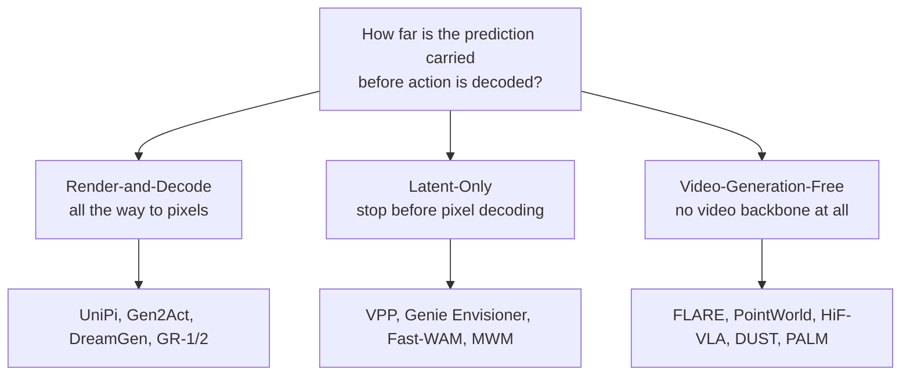
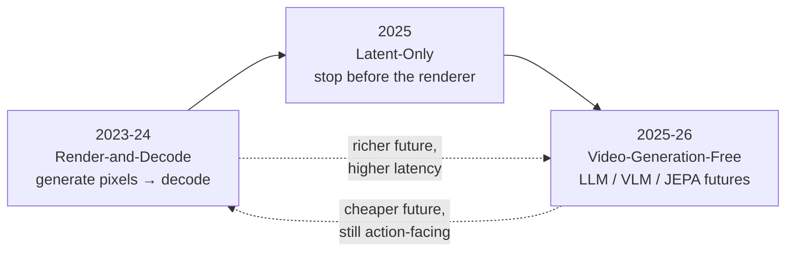

# Three Design Philosophies: How Far Do You Carry the Dream?

Every WAM has to predict *some* future and then act on it. The single question that splits the entire field is deceptively simple:

> **How far along the inference path do you carry the prediction before you decode an action?**

Carry it all the way to rendered pixels? Stop at an intermediate latent? Or skip the video generator entirely? Those three answers are **mutually exclusive** — every WAM in the survey's census lands in exactly one — and they're what Section 3 calls the three design philosophies.

> **Why not split by "cascaded vs. joint" instead?** Because that asks a *different* question — how prediction and action are *arranged* inside the model (Section 2.3). The philosophy split asks *where the prediction is grounded along the inference path*. A Latent-Only WAM can be cascaded or joint; so can a Render-and-Decode one. The two distinctions are separable, and you need both.

## 1. Render-and-Decode — generate the full picture, then read off the action

> "Render-and-Decode is the most direct path from video generation to action. Its premise is that a rendered future is worth producing inside the inference-time control loop because it preserves the full visual prior learned by the video backbone." — *Section 3.1*

Condition a video generator on the observation history and instruction, **produce a future video all the way to pixels**, then decode the next action from that rendered future (inverse dynamics, 6-DoF tracking, dense correspondences, or a dedicated action head). UniPi set the template; GR-1/GR-2 moved the action prediction *inside* the video backbone as joint image-and-action tokens.

The appeal is inspectability — you can literally *watch* what the policy imagined. The cost is blunt:

> "The defining limitation of Render-and-Decode is the price of producing pixels. Each prediction step pays for the full denoising or autoregression schedule, even though the actor rarely consumes the rendered output in its entirety." — *Section 3.1*

And a sharper trap: **visual-quality metrics only weakly predict task success.** A gorgeous rendered future can still produce a useless action.

## 2. Latent-Only — keep the video prior, skip the renderer

Same video-world-model lineage. But the inference path **stops before pixel decoding**. The action is read off a latent, an intermediate denoising feature, a flow field, a semantic mask, or a value map — each cheaper to produce than a full clip.

> "In all cases, the key move is to keep a video-shaped dynamic prior while refusing to pay for the final renderer during action selection." — *Section 3.2*

The cleanest illustration is **UWM**: independent diffusion timesteps for the visual and action branches let it *collapse the visual branch at inference* while keeping the video-trained representation. Genie Envisioner keeps a multi-view video DiT for training (`GE-Base`) but decodes action chunks from a *one-step denoised latent cache* (`GE-Act`). The lesson:

> "Visual prediction shapes the representation, but action selection does not have to render the visual prediction." — *Section 3.2*

The price you pay: you give up pixel-space supervision and the easy visual-quality metrics. The future is no longer something you can simply look at.

## 3. Video-Generation-Free — drop the video generator entirely

> "The Video-Generation-Free philosophy removes the video-generation backbone altogether. Here *video-generation-free* refers strictly to the absence of a pixel-level video backbone in the predictive path." — *Section 3.3*

These models still predict a future — just not as video. The future lives in the embedding or token space of an LLM, a VLM, a JEPA encoder, a deterministic regressor over frozen vision features, or a non-video diffusion head. The common anchors:

- **FLARE** — extra policy tokens are aligned to *future-observation embeddings from a frozen teacher*; the action expert consumes those predicted future tokens. Feature prediction replaces pixel prediction.
- **PointWorld** — predicts action-conditioned **3D point flow** and plans with MPPI over that compact future.
- **DUST** — a VLM with a dual-stream diffusion head predicting future embedding tokens *and* an action together.
- **PALM / HiF-VLA / ICLR-VR** — affordance maps, motion-vector tokens, or a gripper-keypoint polyline.

The future object stays in the inference path; the *representation* is just chosen to be cheaper than video.

## The arc over time — and why it points one direction

The philosophies aren't just a static menu; they appeared in order, and that order tells a story.

Early WAMs took the direct path: generate a visual future, decode action from it. Latent-Only methods kept a video-derived prior but moved the action signal *earlier* in the path. Video-Generation-Free entries are the most recent, replacing the generator with predictive supervision in a compact space. Read top to bottom, the field is doing exactly what the subtitle promises — **generating less of the future while holding on to what control requires.**

These three answer *where* action is grounded. They don't yet say *how* the prediction is produced, *where* action is injected, or *when* the model runs relative to the control loop. That's the four-ingredient anatomy of the next module.
