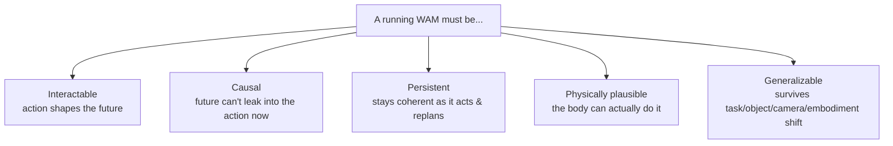
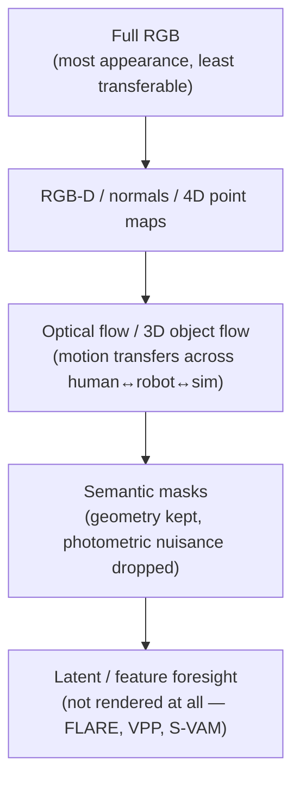

# Five Things a WAM Must Get Right Once It's Running

The anatomy told you how a WAM is *assembled*. This module asks the harder question:

> "Once that assembly is placed inside a control loop and made to run, what must remain true of it?" — *Section 5*

The survey names five properties. And it warns immediately that they **fight each other**:

> "These properties are not independent. A design that improves one property often shifts cost, latency, memory, or error into another." — *Section 5*

That's why WAM design is a set of trade-offs, not a checklist.

## 1. Interactability — does the action actually shape the dream?

A plain video model is only *weakly* interactable. Prompt it to show a cup being lifted and it renders a plausible lift — but nothing ties that imagined motion to the trajectory the controller intends to send.

> "The action is not yet the variable that governs the continuation." — *Section 5.1*

A WAM earns interactability by choosing **where the action enters the prediction loop** — and that choice is a *dial*, running from late binding to early binding:

| Binding | What it means | Examples | Consequence |
|---------|---------------|----------|-------------|
| **Post-prediction** | Future is fully generated, *then* control is recovered | UniPi, AVDC, NovaFlow | Easy to bolt onto a pretrained generator — but controllability arrives only after you've paid the full generation cost |
| **In-generation** | A dedicated action branch runs *alongside* denoising | CoVAR, VAG → UWM, F1, Motus | The future is genuinely shaped by the act it must inform |
| **Earliest** | Learned latent actions injected at *every* denoising step | AdaWorld | Maximally interactable, least modular |

> **So earlier binding is always better?** No — it's a dial, not a ladder. *"The later the action binds, the cheaper and more modular the model; the earlier it binds, the more the predicted future is genuinely shaped by the act."* Bottlenecked designs (AIM's spatial value map, π0.7's sparse subgoal images) deliberately *narrow* the channel — that's exactly what buys cheap, controllable inference, and exactly what caps it: the action can only react to whatever survives the bottleneck.

## 2. Causality — and why it's a *latency* property too

A standard video diffusion model denoises a whole clip jointly, so **future frames can influence the action being taken now**. That's not just philosophically wrong — it's a concrete failure mode:

> "A model that quietly attends to the next frame can grasp flawlessly inside its own rollout and then close on empty air at inference, because the cue it leaned on was never available in real time." — *Section 5.2*

Causality blocks that leak *and* decides where compute is worth spending. Three mechanisms:

- **Causal token streams** — decode future and action as a causal stream, reuse the past via KV-cache (GR-1/2, PhysGen). PhysGen predicts several future action tokens but executes only the leading one.
- **Leakage-free denoising** — forbid action tokens from attending to future-pixel tokens or later actions. WorldVLA's mask both controls error propagation *and* removes expensive attention.
- **Action-prioritized inference** — the controller needs the *next action* more than a fully refined future video, so early-exit the denoising tail. UD-VLA reports **~4× faster** inference this way; LingBot-VA and DreamZero hide world-model latency *behind* execution of the previous chunk.

> "The saved computation is mainly the tail of the denoising trajectory, where distant pixels are refined but the next action has already become stable." — *Section 5.2*

## 3. Persistence — coherence under repeated action

Persistence fails three ways, and the fixes pull against each other:

| Failure | Cause | Tension |
|---------|-------|---------|
| **Drift** | Each predicted step conditions the next; errors compound until the rollout leaves the data manifold | Full-history attention fights it — but raises cost |
| **Cost growth** | Attending to full history grows memory/attention with the horizon | Sliding context bounds it — but discards evidence |
| **Forgetting** | A finite context drops scene identity, so an occluded object reappears in the wrong place | — |

The cheapest fix is **re-grounding** (observation replacement): after each executed chunk, replace *imagined* observations with *measured* ones and update the cache. DreamZero does this through KV-cache observation replacement and hits **7 Hz** closed-loop control with a **14B** autoregressive video-diffusion model. For bounded memory, DexWM keeps a fixed test-time budget (training over 900 hours of interaction); Act2Goal uses multi-scale temporal hashing — dense near-future frames, sparse distal ones.

## 4. Physical plausibility — realizable beats photorealistic

> "The video-world-model instinct equates a good future with a photorealistic one. A WAM needs something stricter." — *Section 5.4*

What matters is whether the predicted dynamics are **realizable by the body** that executes them. The survey lays out an *abstraction ladder* — and the logic is to predict as far *down* it as you can:

> "Each rung down trades away appearance the controller never needed and forces capacity toward geometry, contact, and dynamics, at the price of a future that is harder to inspect." — *Section 5.4*

Two things vision alone can't give you, that contact-rich manipulation needs:

- **Richer physical modalities** — contact state, friction, slip, normal force. OmniVTA predicts future *tactile* states; AdaWorldPolicy adds a *force-prediction* branch and adapts on force-torque mismatch. These are low-dimensional but dense exactly where contact decides success.
- **Embodiment coherence** — a future can look plausible yet be impossible: the arm passes through itself, the end-effector is unreachable. PAD/GR-1/Cosmos Policy condition on proprioception; DexWM adds a hand-consistency loss; MVISTA-4D projects the imagined future onto an executable action with a residual inverse model.

The headline lesson, stated flatly by the survey:

> "How useful the imagined future is for the action predicts task success better than how good it looks." — *Section 5.4*

## 5. Generalization — both halves must survive the shift

Generalization in robotics isn't one axis — it's a *bundle*: new tasks, objects, appearances, rooms, cameras, embodiments, action spaces. The WAM contract makes it stricter than VLA or video generalization:

> "Generalization requires both sides of the model to survive the shift. The predictive substrate must remain useful, and the action pathway must still execute the prediction." — *Section 5.5*

Two transfer strategies recur:

- **Video-prior transfer** — large language-conditioned video pretraining helps unseen scenes (GR-1/2, VideoVLA, DreamZero with robot-to-robot and human-to-robot transfer). But *"scale helps only once the future is connected to the action,"* and that connection costs an inverse model, a subgoal generator, or a big video backbone.
- **Substrate transfer** — when pixels carry too much appearance-specific detail, move the transferable variable down the ladder. Flow suppresses texture and camera style (Im2Flow2Act, 3DFlowAction); semantic masks resist background/lighting/color shift (MWM); feature-space forecasting goes deepest (FRAPPE, LDA-1B). The catch with flow: *"it leaves the hard part to the executor, which still has to solve grasping, collision avoidance, and contact."*
