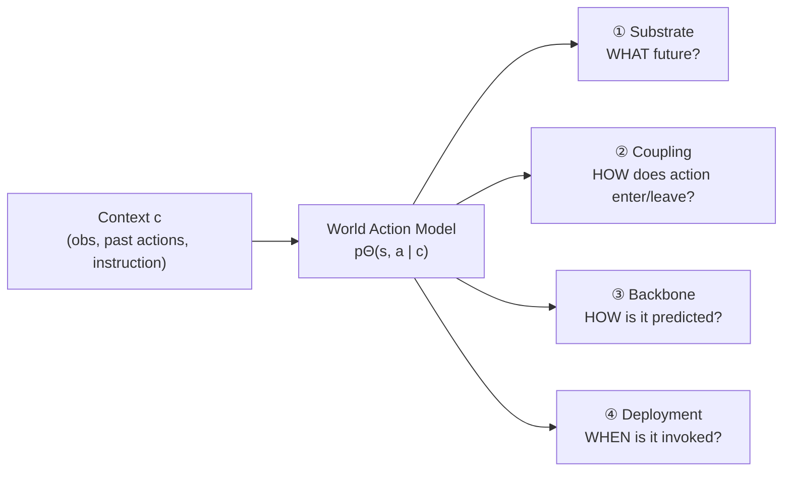
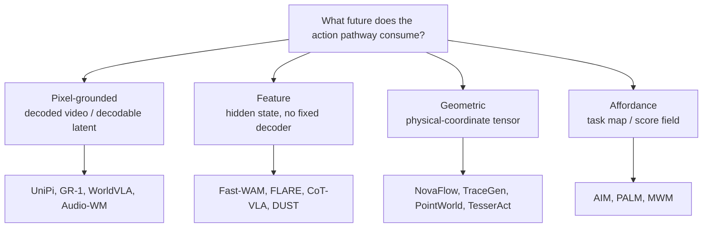

# The Anatomy, Ingredient 1: What Future Do You Predict?

The philosophy taxonomy sorted WAMs by *where* action is decoded along the inference path. Useful — but two methods with the same philosophy can still behave nothing alike. Section 4 takes a sharper route: treat every WAM as one mathematical object and pin it down by **four separable choices**.

> "It treats WAMs as instances of a common mathematical object: a conditional joint distribution over future predictions and future actions." — *Section 4*

Here's the object. Don't let the indices scare you:

> pΘ( st+1:t+H , at:t+H−1 | o≤t , a&lt;t , l )  — *Equation 8*

Read it as: given the **observation history**, **past actions**, and an **instruction** `l`, predict a future trajectory `s` of length `H` *in some chosen substrate space `S`*, **together with** an action chunk `a` of the same length. The whole survey abbreviates the conditioning side as `c = (o≤t, a<t, l)`.

Every WAM is then four choices about how that one equation is realized:

> **Why insist the four axes are separable if they interact?** Because they isolate *different questions*. Substrate asks what kind of future variable exists; backbone asks how it's predicted; coupling asks how actions enter or are recovered; deployment asks how the model is invoked in a control loop. Substrate and backbone are usually fixed at *training* time; deployment and some coupling wrappers can be changed at *inference*. Mixing the questions is exactly what made the field confusing.

This lesson covers **ingredient ①, the predictive substrate** — the space `S` where the future actually lives.

## The substrate is *where the future lives*, not the last tensor the action head touches

This is the subtlety that trips people up. A video-diffusion model may denoise a VAE latent grid and **skip pixel decoding** during control — yet if a fixed decoder *could* map that grid back to video, the future is still **pixel-grounded**. Conversely, a policy may read an intermediate state from a video trunk, but if that state has *no* fixed observation decoder, it's a **feature** substrate.

> "We... classify a WAM by the representation in which it forms the future used for action prediction or evaluation." — *Section 4.2*

## The four substrate categories

| Substrate | What it is | The trade-off |
|-----------|------------|---------------|
| **Pixel-grounded** | Decoded RGB/RGB-D/multi-view, *or* VAE/VQ latents with a **fixed video decoder** | Preserves appearance, contact traces, broad video priors — but pays for detail many actions don't need |
| **Feature** | A learned hidden state, teacher embedding, or VLM token block with **no fixed observation decoder** | Compact, semantically invariant — but **no visual-fidelity metric** to check it against |
| **Geometric** | A structured tensor of physical coordinates: optical flow, point tracks, depth, pose, motion vectors, polylines | Far smaller than a pixel tensor, trainable on less data — but only reliable when motion/contact carries the task |
| **Affordance** | A task-specific label or score map: value maps, contact maps, segmentation, progress, heatmaps | Compact and directly useful for manipulation — but the labels must be defined *for that task* |

A few sub-distinctions worth keeping straight:

- **Pixel-grounded splits two ways.** *Decoded* observations (UniPi renders frames, then runs inverse dynamics) vs. *pixel-decodable latents* (GR-1/GR-2 predict VQ image tokens; UWM and τ0-WM denoise VAE video latents). Both are pixel-grounded because a fixed decoder ties them to an observation frame.
- **Feature has four flavors:** encoder-only (Fast-WAM masks its future branch at test time), feature-tap (VPP, Genie Envisioner read an intermediate denoising state), teacher-target (FLARE predicts a frozen encoder's embedding), and VLM-token (CoT-VLA, DUST).
- **Joint cells (∧).** Some WAMs predict two substrates in one forward pass — DriveDreamer-Policy is *Pixel ∧ Geometric*, JOPAT is *Feature ∧ Geometric*. The survey marks these with the `∧` separator.

## The one rule that resolves most arguments

When you can't decide a substrate, ask: **is there a fixed decoder back to the observation, and is it a coordinate tensor or a task map?**

> "Fast-WAM is feature-substrate and encoder-only because its future branch is masked at inference... τ0-WM is pixel-grounded-substrate and joint-denoising because it predicts a Wan VAE video latent... mimic-video is feature-substrate and post-prediction-head because the action head taps an intermediate ODE state of a frozen video trunk." — *Section 4.2.5*

Notice the survey is already naming *two* axes there — substrate **and** coupling. They're orthogonal. The substrate names *where* the WAM forms its future; coupling (the next lesson) names *how* that future reaches the action.
