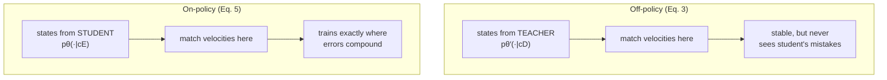

# Should the student practice on the teacher's road, or its own?

Distillation means: make the student's velocity field agree with the teacher's. The obvious way is to grab states the *teacher* visits and ask the student to predict the same velocity there.

> The **off-policy** objective (Eq. 3):
> `Loff = E over (xₜ,t) ~ teacher [ ‖vθ(xₜ,t | cE) − vθ′(xₜ,t | cD)‖² ]`

The states `xₜ` come from the teacher's trajectories. This is **stable** — the states don't depend on the student, so the target never moves under your feet. But there's a catch you can probably guess:

> "it constrains the student only on teacher trajectories, so errors may compound during student rollouts, a familiar issue in off-policy imitation and distillation settings." — *Section 3*

It's the student-driver problem. If you only ever practice on roads your *instructor* drives, the first time you take a wrong turn you're somewhere you've never seen, with no idea how to recover. The mistakes happen exactly where you got no training.

## On-policy distillation: practice where the student actually goes

The fix is to evaluate the teacher–student gap on the **student's own** trajectories.

> Define the per-state discrepancy (Eq. 4):
> `ℓθ(xₜ,t) = ‖vθ(xₜ,t | cE) − vθ′(xₜ,t | cD)‖²`
>
> The **on-policy** objective (Eq. 5) averages `ℓθ` over states `xₜ ~ pθ` — *the student's* rollouts.

The price: now the objective depends on `θ` in *two* ways — through the velocity field **and** through the rollout distribution itself (the student chooses which states get visited). That second dependence is what turns a regression problem into something with the flavor of reinforcement learning.

## The trick that connects distillation to RL

Differentiate the on-policy objective and it splits into two terms (the score-function / log-derivative decomposition, Eq. 7):

> `∇θ Lon = E[ Cθ(τ) · ∇θ log pθ(τ | cE) ]  +  E[ ∇θ Cθ(τ) ]`

where `Cθ(τ)` is the total teacher–student discrepancy accumulated along trajectory `τ` (Eq. 6). Read the two terms:

| Term | What it does | Looks like |
|---|---|---|
| First | re-weights *how likely* each trajectory is, by its discrepancy | a **policy gradient** with reward `−Cθ(τ)` |
| Second | adjusts the velocity field directly on student states | ordinary **vector-field regression** |

That first term is the unlock. "Make low-discrepancy trajectories more likely" is *exactly* the shape of a policy-gradient update — so the same machinery that does distillation can also absorb a **task** reward later. The discrepancy just becomes one reward among others.

> "Distillation as a reward... trajectories with low teacher–student discrepancy should become more likely." — *Section 3*

So WMSD defines a **distillation reward** (Eq. 9): the negative accumulated discrepancy, with the student *detached* (`sg[·]`, stop-gradient) so it acts purely through trajectory likelihood rather than direct backprop.

> `r_distill(τ) = − ∫ ‖ sg[vθ(xₜ,t|cE)] − vθ′(xₜ,t|cD) ‖² dt`

Up-weight rollouts whose dynamics agree with the Demonstrator; down-weight the ones that drift.

## Why on-policy matching is actually *safe*

You might worry: if the student only matches velocity on its own wandering trajectories, can the final videos drift arbitrarily far from the teacher's? The paper proves they can't.

> **Proposition 1 (informal).** If teacher and student start from the *same noise* `x₀`, the teacher's velocity field is Lipschitz, and the student matches it well on its own trajectories (mean squared gap ≤ `ε²`), then the final outputs are close:
> `W₂(student's x₁, teacher's x₁) ≤ e^L · ε` — *Section 3*

In words: **small per-step velocity errors can't blow up into wildly different videos** — they're bounded by the matching error `ε` (times a constant from how fast the teacher's field changes). The proof is a standard Grönwall argument. This is the guarantee that lets WMSD train on-policy without the student spiraling off into nonsense — and it's why the frozen Demonstrator can safely act as an *anchor* once RL starts pushing the student around, which is the next lesson.
