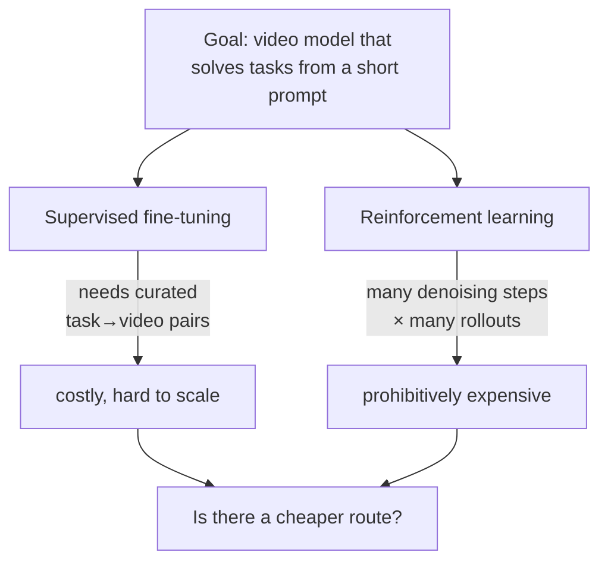

# A world model that won't take a hint

You have a state-of-the-art video generator. Feed it a paragraph like *"the man in the white shirt steps forward, his right hand reaching toward the truck's open driver-side door frame..."* and it produces a strikingly plausible video of exactly that.

Now ask it to **"open the truck door."**

It stalls. Not because it can't render the action — you just saw it do that — but because it was trained to *paint the caption you hand it*, not to *figure out the caption itself*. The reasoning ("how do I open a door?") was never its job. Some other model — a language model or a vision-language model (VLM) — has to write the detailed description first.

> The paper's framing of the gap:
> "their reliance on textual conditioning, typically requiring a detailed description of the scene or action, limits their direct applicability to task solving... they do not autonomously infer how to execute a task." — *Section 1*

That's the whole problem. A video world model is supposed to let an agent *imagine* how to achieve a goal. But if it needs you to spell out the solution before it can imagine it, it isn't planning — it's tracing.

## The two obvious fixes both hurt

**Supervised fine-tuning (SFT).** Collect pairs of (task instruction, video of a successful execution) and train the model to reproduce them. Clean idea — but where do the videos come from?

> "this approach requires a large and diverse set of successful demonstrations, covering many environments, objects, and levels of task abstraction. Acquiring such data is costly, especially when tasks are long-horizon." — *Section 1*

**Reinforcement learning (RL).** Let the model propose solutions, score them, and reinforce the good ones. No fixed dataset to curate — but video generators are diffusion/flow models that need *many* denoising steps to produce a single clip, and RL needs *many* rollouts per update.

> "naively applying RL to multi-step video generators is prohibitively expensive." — *Section 1*

> **Wait — can't we just outsource the reasoning to a VLM at inference time?** You can, and that's a real baseline (the paper calls it the *Demonstrator* setting). But then your world model never *learns* to plan; it stays a renderer, and every single task incurs an extra VLM call to write the description. The goal here is to bake the reasoning *into* the world model itself.

## The key idea: distill the reasoning, then let RL push past it

WMSD ("World Model Self-Distillation") gets the best of both without paying either bill in full:

1. A VLM looks at an unlabeled image and invents both a **task** ("cut the carrots") and a **detailed solution description**.
2. The detailed description conditions the pretrained video model — now called the **Demonstrator** — to produce a good execution.
3. A second copy of the model, the **Executor**, sees *only the image and the short task*, and is trained to match the Demonstrator's output. It learns to map instructions → action sequences directly. No human-curated task videos.

> "We distill its behavior into an Executor conditioned only on the image and a short task prompt. This transfers execution knowledge from caption-guided generation to instruction-conditioned task solving without curated task-video supervision." — *Abstract*

But self-distillation has a ceiling: the student can only get as good as its teacher.

> "it remains constrained by the task-solving ability of the demonstrator, effectively placing an upper bound on performance." — *Section 1*

So WMSD adds RL on top — and the reward comes from the same VLM, exploiting an asymmetry you already trust in everyday life: **judging a solution is easier than producing one.**

> "for many structured tasks, finding a valid solution can be much harder than checking a proposed one." — *Section 1*

## The four contributions, in one place

| # | Contribution |
|---|---|
| 1 | Self-distillation that turns caption-conditioned video models into **instruction-conditioned task solvers**, with no paired task-execution videos |
| 2 | **RL from VLM feedback** that lets the Executor *surpass* its teacher under VLM-based evaluation |
| 3 | A **task–solution prompt dataset** (WorldTasks) derived by VLMs from unlabeled images |
| 4 | A **benchmark** (WorldTasks-Bench) for general task-solving in generated videos |

Keep two names straight from here on — they recur in every later lesson:

- **Demonstrator** = the teacher. Sees the *rich* description `D`. Fixed (frozen).
- **Executor** = the student. Sees only the *short* task `T`. The thing we train.
