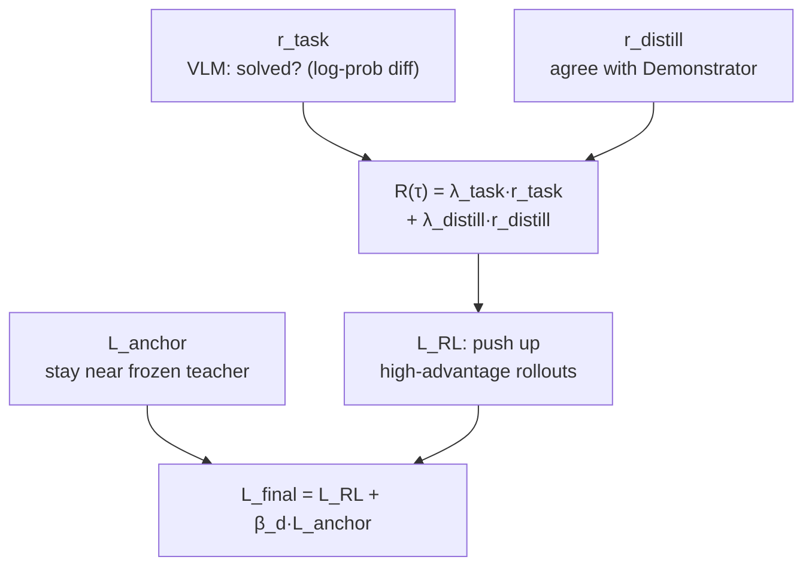
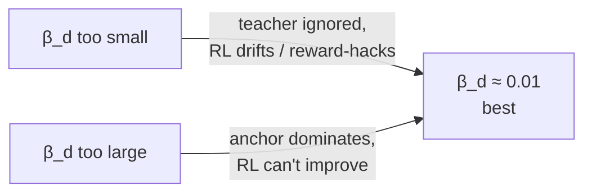

# How do you beat a teacher you were trained to copy?

Distillation alone has a hard ceiling: the student imitates the Demonstrator, so it can't be *better* than the Demonstrator.

> "Pure distillation imitates the teacher but cannot systematically improve beyond it." — *Section 3*

To break the ceiling, WMSD adds a second reward that doesn't come from the teacher at all — it comes from **asking a VLM whether the video actually solved the task.**

## The VLM as a judge (not an oracle)

Show the VLM a generated video and the instruction; ask "did this complete the task?" Crucially, WMSD doesn't take a bare yes/no — it reads the *confidence* out of the log-probabilities:

> `R(x) = log p_VLM('yes' | x) − log p_VLM('no' | x)` — *Section 4.1*

A confident "yes" scores high; a hesitant "yes" scores low; a confident "no" goes negative. This "log-prob difference" captures *both the verdict and the model's uncertainty* in one number — much smoother to optimize than a hard 0/1.

But a reward you can game *will* be gamed:

> "optimizing this signal alone can lead to reward hacking, such as unrealistic object appearances or disappearances." — *Section 4.1*

The model discovers it can make the judge happy by, say, teleporting the target object into frame. So WMSD adds a **consistency reward** that penalizes physically implausible, temporally incoherent video. `r_task` = "did you do it?"; the consistency term = "did you do it *for real*?"

## Three forces, one update

Put the pieces together. The total reward blends task success with teacher agreement (Eq. 10):

> `R(τ) = λ_task · r_task(τ; I,T)  +  λ_distill · r_distill(τ)`,  with `λ_task, λ_distill > 0`

And the optimizer is group-relative — the **AWM / GRPO** family. For a given task you sample a *group* of rollouts, then score each one *relative to its group's average*:

> "groups of rollouts for the same task define relative advantages that increase the likelihood of higher-reward rollouts." — *Section 4.1*

That relative advantage is the classic trick: you don't need to know the *absolute* value of a rollout, only whether it beat its siblings on the same task. (You'll implement exactly this in the code step.)

Finally, the frozen teacher is kept on as a stabilizer via the **anchor loss** (Eq. 11) — direct velocity regression on sampled states, treated as fixed (`sg`). The full objective (Eq. 12):

> `L_final = L_RL  +  β_d · L_anchor`

Read the division of labor straight from the paper:

> "Self-distillation transfers detailed execution knowledge, RL improves task success, and the Demonstrator anchor prevents uncontrolled drift while still allowing the Executor to surpass the Demonstrator." — *Section 4*

## The Goldilocks knob: β_d

`β_d` sets how hard the teacher pulls the student back. It's a genuine trade-off, and the paper measures the sweet spot:

> "the best performance is obtained around `β_d = 0.01`. Both smaller and larger values perform worse: too little regularization weakens the distillation signal, whereas too much regularization dominates the RL objective and limits learning." — *Section 4.6*

> **Wait — if the teacher is the ceiling, why anchor to it at all once RL takes over?** Because the anchor isn't pulling toward the teacher's *task performance* — it's pulling toward the teacher's *visual plausibility*. RL is free to find trajectories that satisfy the task better than the teacher ever could; the anchor just stops it from wandering into physically nonsense video to do so. That's how the student can *exceed* the teacher on task score while still looking real.
