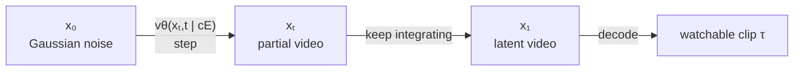
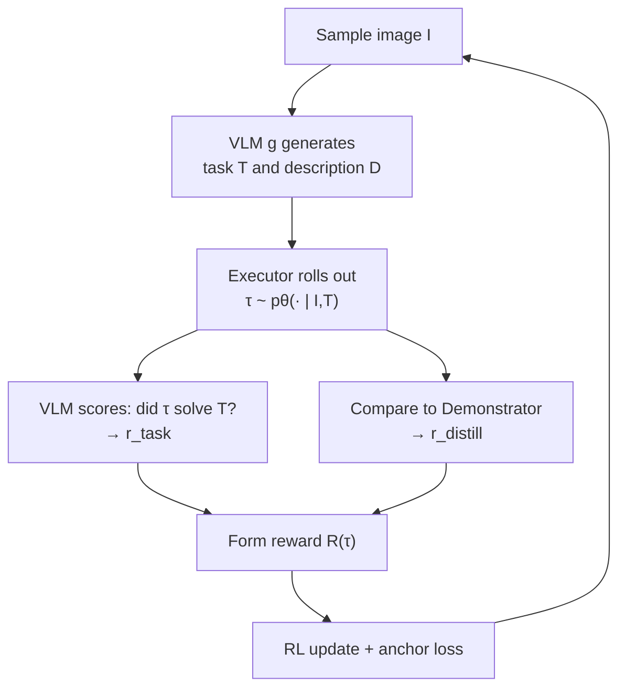

# The teacher and the student see different things

Before any clever objective, WMSD needs a precise setup. Here it is in one sentence: **two copies of the same video model, given different amounts of information about the same task.**

> "Each example contains an initial observation `I`, a short task instruction `T`, and a detailed execution description `D`. The student, or Executor, is conditioned only on `cE = (I, T)`, whereas the teacher, or Demonstrator, is conditioned on the richer description `cD = (I, D)`." — *Section 3*

So every training example is a triple:

| Symbol | Meaning | Who sees it |
|---|---|---|
| `I` | initial observation (the starting image) | both |
| `T` | short task instruction — *"cut the carrots"* | Executor (student) |
| `D` | detailed step-by-step execution description | Demonstrator (teacher) |

The teacher is **frozen** (parameters `θ′`). The student (`θ`) is the only thing we update. The asymmetry — privileged `D` for the teacher, bare `T` for the student — *is the lesson the student has to learn*: how to act well when no one hands you the play-by-play.

## What "the model" actually is: a flow-matching video generator

WMSD uses **conditional flow-matching** video models. You don't need the full theory, just the shape of it.

Think of generation as **a trip from pure noise to a real video**. Flow time `t` runs from `0` to `1`:

- At `t = 0`: `x₀` is random Gaussian noise.
- At `t = 1`: `x₁` is a real (latent) video, which gets decoded into the clip you watch.
- In between: `xₜ` is a partly-formed video at flow time `t`.

The model's job is to predict a **velocity field** `v(xₜ, t | c)` — "given where you are now and how far along you are, which direction should you move?" Integrate that velocity from noise to data and you've generated a video.

> A student flow trajectory satisfies (Eq. 2):
> `dxₜ/dt = vθ(xₜ, t | cE)`, with `x₀ ~ p₀` (Gaussian noise).

The teacher is identical in form — same equation, just `vθ′` and `cD` instead of `vθ` and `cE`.

> **Why velocity instead of just outputting the video?** Because generation is a *path*, not a single jump. Predicting a velocity field at every point lets you start from any noise sample and follow a smooth trajectory to a coherent video — and, crucially, it gives WMSD a per-step quantity it can compare between teacher and student. That comparison is the entire next lesson.

## The whole trajectory has a name: `τ`

The sequence of states `xₜ` from `t=0` to `t=1` is a **trajectory** `τ = {xₜ}`. The student and teacher each induce a distribution over trajectories:

- `pθ(τ | cE)` — trajectories the **student** tends to roll out, from the short prompt.
- `pθ′(τ | cD)` — trajectories the **teacher** tends to roll out, from the rich description.

The goal, stated plainly:

> "train the student to solve tasks from `cE`, using the teacher under `cD` as dense guidance." — *Section 3*

Hold onto that phrase **"dense guidance."** The teacher doesn't just give the student a final answer to copy — it gives a velocity it can be compared against *at every point along the way*. That's what makes the next step (on-policy distillation) possible, and it's why a frozen teacher is so much more useful here than a static dataset of finished videos.

## The end-to-end pipeline (Algorithm 1)

Each training iteration strings together everything you'll meet in the next two lessons:

Three ingredients, one loop: the VLM *invents and judges* tasks, the Demonstrator *guides*, and the Executor *learns to act from the short prompt alone*. Next we make the "compare to Demonstrator" arrow precise.
