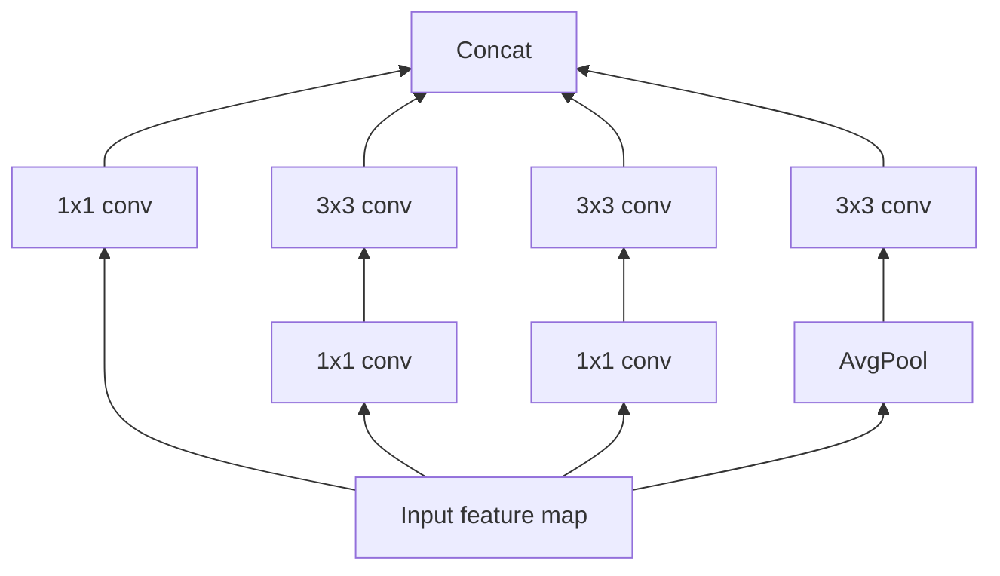

Take a single 3×3 convolution kernel. It has to do two jobs at once: figure out which spatial neighbors matter (the "3×3" part) *and* figure out which channels correlate with each other (the "depth" part). One kernel, two unrelated questions, answered jointly.

> What if those two questions didn't need to be answered together?

That's the question Chollet's 2016 paper *Xception: Deep Learning with Depthwise Separable Convolutions* asks — and it leads to an architecture that "slightly outperforms Inception V3 on the ImageNet dataset... and significantly outperforms Inception V3 on a larger image classification dataset comprising 350 million images and 17,000 classes," with the same parameter count. Same capacity, better accuracy — the gain has to come from somewhere else: a smarter way of *using* those parameters.

## Where Inception already started this split

By 2016, the Inception family (GoogLeNet → Inception V2/V3) was already winning ImageNet by *not* treating convolution as one joint operation. The paper frames the **Inception hypothesis** directly:

> "The fundamental hypothesis behind Inception is that cross-channel correlations and spatial correlations are sufficiently decoupled that it is preferable not to map them jointly." — Section 1.1

Concretely, a canonical Inception module first runs 1×1 convolutions to compress cross-channel information into a few smaller spaces, *then* runs regular 3×3 or 5×5 convolutions on each of those smaller spaces separately, and concatenates the results:

This is "Figure 1" from the paper: a canonical Inception V3 module. Each of the four parallel towers handles cross-channel mixing (1×1) and spatial mixing (3×3) as separate steps — but only partially: there are still just 3-4 towers, each looking at a chunk of channels together.

> **Wait — isn't a 1×1 convolution still "joint"?** A 1×1 convolution only mixes across channels at a single spatial location — it has no spatial extent, so it can't mix space and channels together. The factoring is real: 1×1 handles channels, 3×3/5×5 handle space. What's *not* yet fully separated is how many channels get bundled into each spatial convolution — Inception puts a few hundred into 3-4 towers.

## The question this raises

If decoupling channels from space helps a *little* (3-4 towers), why stop there? What happens if you push the decoupling all the way — one tower *per channel*? That's the question the rest of the paper chases, and it's the difference between an Inception module and a depthwise separable convolution.
