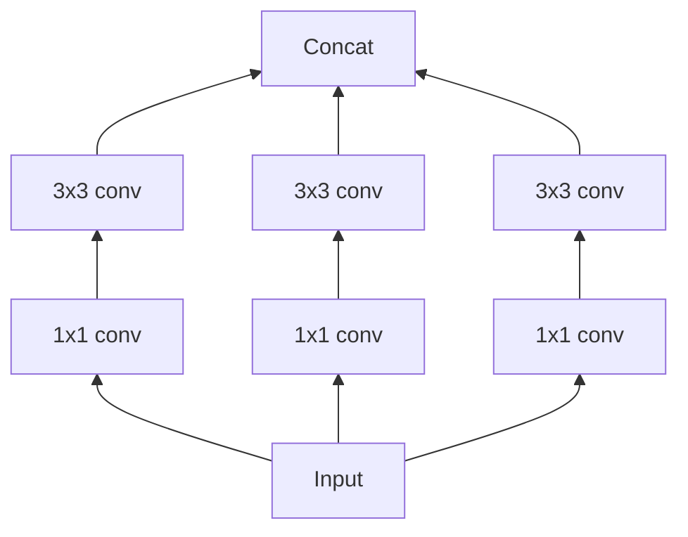
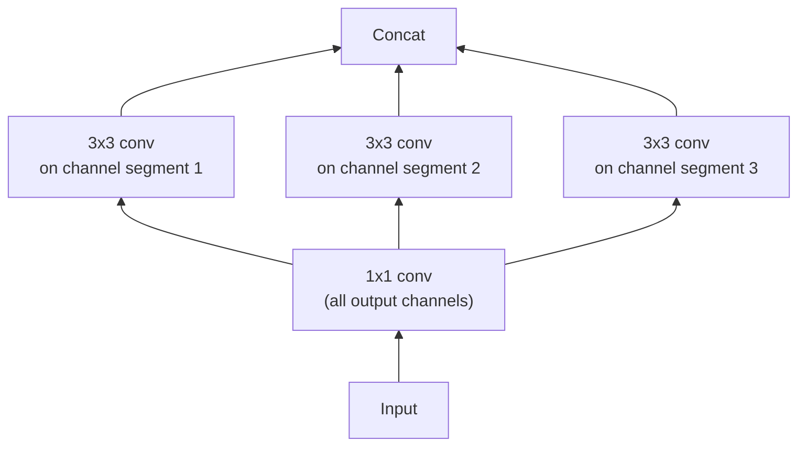
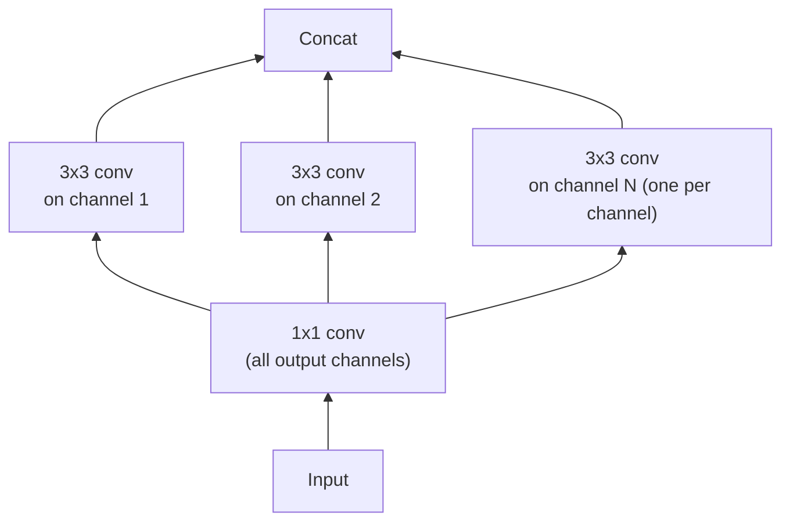

Strip the canonical Inception module down to its simplest form: one branch size only (3×3), no pooling tower. Now look at what it's actually computing.

This is "Figure 2," the simplified module. The paper makes an observation that sounds like a trick but is just algebra: the three small 1×1 convolutions here are equivalent to *one big* 1×1 convolution, followed by spatial convolutions that each only look at a *non-overlapping slice* of the resulting channels:

"Figure 3" — a *strictly equivalent* reformulation. Nothing changed mathematically; we've just regrouped the same computation. But regrouping it this way exposes a tunable knob the original framing hid: **how many segments do you split the channels into?**

## The knob nobody had turned all the way

> "This observation naturally raises the question: what is the effect of the number of segments in the partition (and their size)?" — Section 1.1

A regular convolution (1×1 followed by one big spatial conv) is the *one-segment* case. Inception modules use a *few-segment* case — a few hundred channels divided into 3 or 4 towers. What's at the *other* end of that spectrum — one segment **per channel**?

"Figure 4" — the **"extreme" Inception module**: one independent spatial convolution per output channel of the 1×1. Push the Inception hypothesis as far as it goes, and you arrive almost exactly at an operation deep learning frameworks already had a name for.

## Depthwise separable convolution

> "A depthwise separable convolution... consists in a depthwise convolution, i.e. a spatial convolution performed independently over each channel of an input, followed by a pointwise convolution, i.e. a 1×1 convolution, projecting the channels output by the depthwise convolution onto a new channel space." — Section 1.2

"Extreme Inception" and a depthwise separable convolution differ in exactly two small ways, both called out directly in the paper:

| Difference | Extreme Inception | Depthwise separable conv |
|---|---|---|
| Order of operations | 1×1 (channels) **first**, then spatial | Spatial (depthwise) **first**, then 1×1 (pointwise) |
| Non-linearity between the two steps | ReLU after both steps | Usually **none** in between |

> **Does the order matter?** The paper argues no — "these operations are meant to be used in a stacked setting," so first-vs-second is just a bookkeeping choice once you chain many of them. The non-linearity question matters more, and gets its own experiment later in the paper (Section 4.7) — with a surprising answer.

## One spectrum, three points

Regular convolutions and depthwise separable convolutions are the two extremes of a single, discrete spectrum — parametrized by how many channel-groups share a spatial convolution. Inception modules sit in the middle. The paper's proposal, previewed by its name: **Xception**, "Extreme Inception" — build a whole network out of the *extreme* end of that spectrum, and see what happens.
